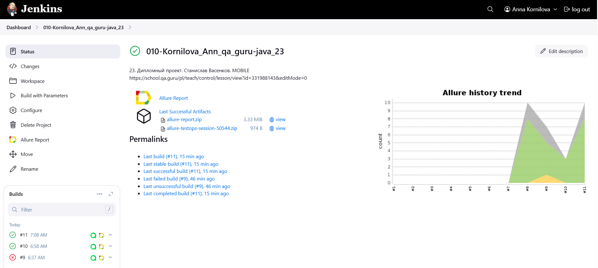
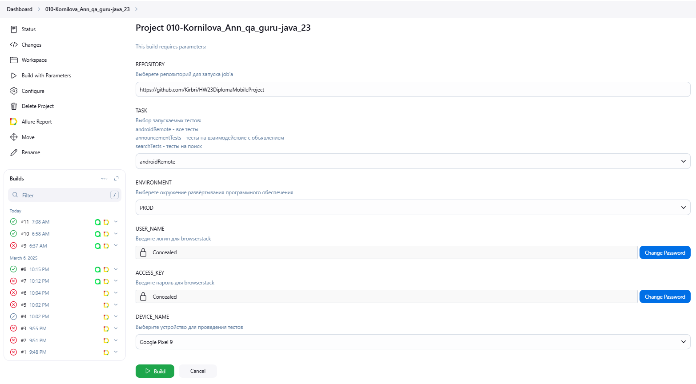
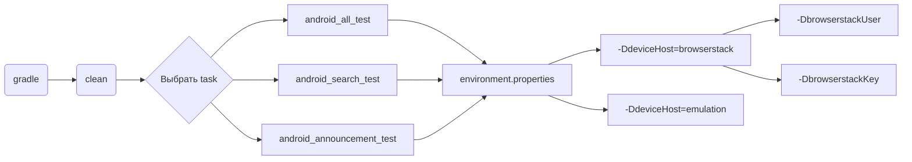
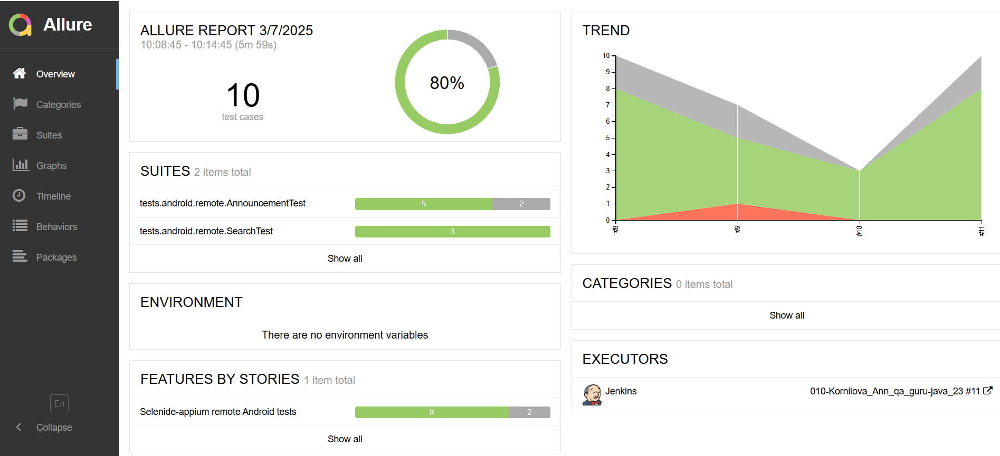
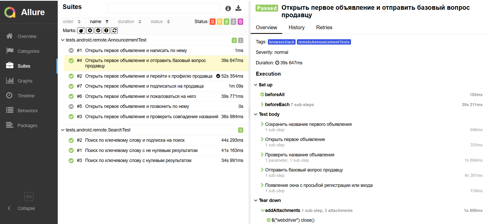
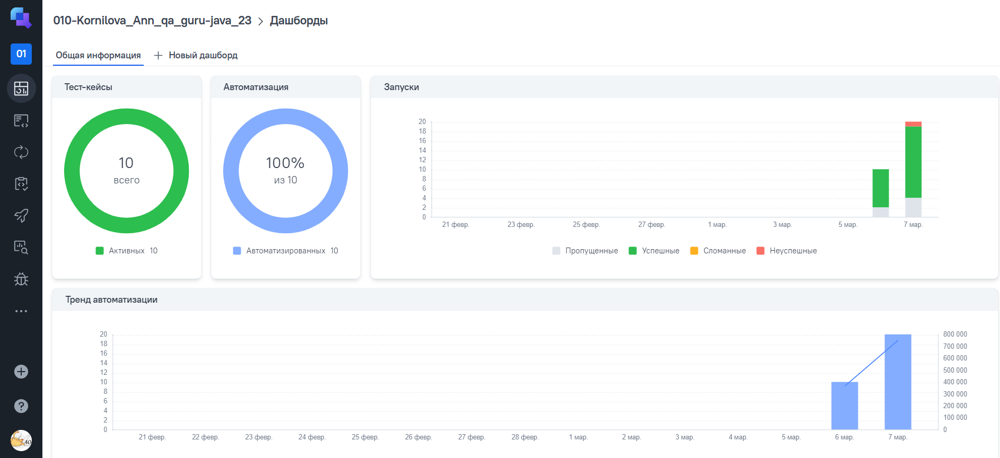
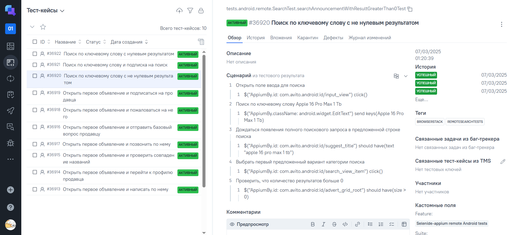
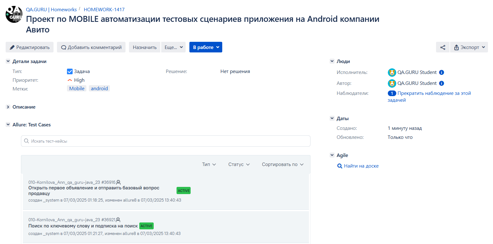
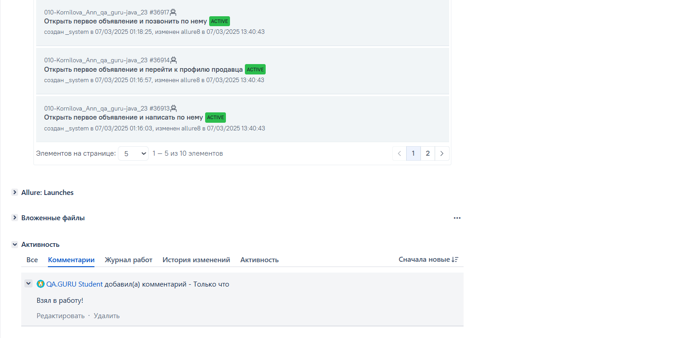
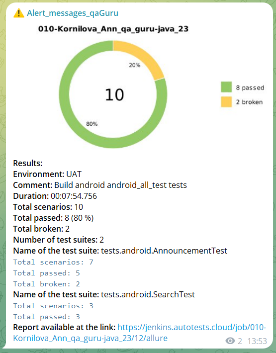

# <p align="center">Проект по мобильной автоматизации тестовых сценариев для android приложения компании [Авито](https://www.avito.ru/)</p>

> Ави́то — российский интернет-сервис для размещения объявлений о товарах, недвижимости, вакансиях и резюме на рынке труда, а также услугах, занимающий первое место в мире среди сайтов объявлений

 ____

<a id="table_of_contents"></a>
## Содержание

* <a href="#tools">Технологии и инструменты</a>
* <a href="#project_goal">Цель проекта</a>
* <a href="#cases">Реализованные автотесты</a>
* <a href="#jenkins">Сборка в Jenkins</a>
* <a href="#jenkins_parameters">Параметризированная сборка в Jenkins</a>
* <a href="#console">Запуск тестов</a>
* <a href="#allure">Allure отчет</a>
* <a href="#allure-testops">Интеграция с Allure TestOps</a>
* <a href="#jira">Интеграция с Jira</a>
* <a href="#notifications">Уведомления</a>
* <a href="#video">Примеры видео выполнения тестов</a>

___

<a id="tools"></a>
## <a name="Технологии и инструменты">Технологии и инструменты на проекте</a>

- Проект написан на **Java** с использованием фреймфворка **Selenide**
- Для модульного тестирования использовался **JUnit 5**
- На платформе **BrowserStack** были найдены локаторы и запущены удалённые тесты
- С помощью **Android Studio** создан эмулятор на котором найдены локаторы и запущены тесты, с помощью **Appium**
- <a href="#allure">Отчётность</a> представлена в **Allure Report**
- <a href="#jenkins">Непрерывная интеграция</a> и непрерывное развертывание реализовано через **Jenkins**
- **Telegram** и почтовый агент используются для получения <a href="#notifications">уведомлений</a>


| Логотип | Описание                                                                                                                                      |
| --- |-----------------------------------------------------------------------------------------------------------------------------------------------|
| <a href="https://www.jetbrains.com/idea/"> | IntelliJ IDEA — интегрированная среда разработки программного обеспечения.                                                                    |
| <a href="https://www.java.com/ru/"> | Java — строго типизированный объектно-ориентированный язык программирования общего назначения.                                                |
| <a href="https://github.com/"> | GitHub — крупнейший веб-сервис для хостинга IT-проектов и их совместной разработки.                                                           |
| <a href="https://junit.org/junit5/"> | JUnit — фреймворк для модульного тестирования программного обеспечения на языке Java.                                                         |
| <a href="https://gradle.org/"> | Gradle — система автоматической сборки.                                                                                                       |
| <a href="https://www.jenkins.io/"> | Jenkins — программная система предназначенная для обеспечения процесса непрерывной интеграции программного обеспечения.                       |
| <a href="https://www.atlassian.com/software/jira"> | Jira — система отслеживания ошибок, предназначена для организации взаимодействия с пользователями и управления проектами.                     |
| <a href="https://github.com/allure-framework"> | Allure - фреймворк для создания простых и понятных отчётов автотестов.                                                                        |
| <a href="https://selenide.org/"> | Selenide - это фреймворк для автоматизированного тестирования веб-приложений на основе Selenium WebDriver.                                    |
| <a href="https://appium.io/"> | Appium — ПО, разработанное для упрощения автоматизации пользовательского интерфейса многих платформ приложений, включая мобильные устройства. |
| <a href="https://www.browserstack.com/"> | BrowserStack — это облачная платформа для веб-тестирования и мобильного тестирования.                                                         |
| <a href="https://developer.android.com/studio"> | Android Studio — интегрированная среда разработки (IDE) для работы с платформой Android.                                                      |
| <a href="https://qameta.io/"> | Allure Testops - полноценное управление тестированием, ориентированное на автоматизацию, согласованное с DevOps.                              |
| <a href="https://telegram.org/">| Telegram — кроссплатформенный мессенджер.                                                                                                     |

<a href="#table_of_contents">Наверх</a>
____

<a id="project_goal"></a>
## <a name="Цель проекта">Цель проекта </a>

> <p>Проект является демонстрационным и включает в себя ряд мобильных автоматизированных тестов, охватывающих различные аспекты функциональности, обеспечивая качество, надежность и стабильность работы приложения.</p>

<a href="#table_of_contents">Наверх</a>

 ____

<a id="cases"></a>
## <a name="Реализованные автотесты"> Реализованные автотесты </a>
### 1. Поиск объявлений

- [x] Поиск по ключевому слову с нулевым результатом;
- [x] Поиск по ключевому слову с не нулевым результатом;
- [x] Поиск по ключевому слову и подписка на поиск.

### 2. Открытие первого объявления и взаимодействие с ним

- [x] Открыть первое объявление и проверить совпадение названий;
- [x] Открыть первое объявление и позвонить по нему;
- [x] Открыть первое объявление и написать по нему;
- [x] Открыть первое объявление и отправить базовый вопрос продавцу;
- [x] Открыть первое объявление и перейти к профилю продавца;
- [x] Открыть первое объявление и подписаться на продавца;
- [x] Открыть первое объявление и пожаловаться на него.

<a href="#table_of_contents">Наверх</a>

____

<a id="jenkins"></a>
## <a name="Сборка в Jenkins"> Сборка в [Jenkins](https://jenkins.autotests.cloud/job/010-Kornilova_Ann_qa_guru-java_23/) </a>

Для запуска сборки необходимо перейти в раздел Build with Parameters и нажать кнопку Build

<p align="center">  
<a href="https://jenkins.autotests.cloud/job/010-Kornilova_Ann_qa_guru-java_23/"></a>  
</p>

<a id="jenkins_parameters"></a>
### <a name="Параметры сборки в Jenkins"> Параметры сборки в Jenkins </a>

- **REPOSITORY** - репозиторий источник данных для запуска тестов
- **TASK** - выбор группы тестов
- **USER_NAME ACCESS_KEY** - учётные данные от платформы browserstack
- **DEVICE_NAME** - модель телефона

<p align="center">  
<a href="https://jenkins.autotests.cloud/job/010-Kornilova_Ann_qa_guru-java_23/build?delay=0sec"></a>  
</p>

<a href="#table_of_contents">Наверх</a>

_____

<a id="console"></a>
## Команды для запуска тестов

> [!NOTE]
> 
> **[Иструкция](https://autotest.how/appium-setup-for-local-android-tutorial-md) по настройке и запуску** 
> 
> Для локального запуска необходимо установить:
> - [Java](https://github.com/qa-guru/knowledge-base/wiki/%D0%98%D0%BD%D1%81%D1%82%D1%80%D1%83%D0%BC%D0%B5%D0%BD%D1%82%D1%8B:-Java), 
> - [Gradle](https://github.com/qa-guru/knowledge-base/wiki/%D0%98%D0%BD%D1%81%D1%82%D1%80%D1%83%D0%BC%D0%B5%D0%BD%D1%82%D1%8B:-Gradle), 
> - Cреда разработки, например, [IntelliJ IDEA](https://github.com/qa-guru/knowledge-base/wiki/%D0%98%D0%BD%D1%81%D1%82%D1%80%D1%83%D0%BC%D0%B5%D0%BD%D1%82%D1%8B:-IntelliJ-IDEA)
> - [Android studio](https://developer.android.com/studio)
> - [node.js](https://nodejs.org/en/download)
> - [npm](https://www.npmjs.com/)
> - [Appium Server](https://github.com/appium/appium)
> - Драйвер [UiAutomator2](https://appium.io/docs/en/2.1/quickstart/uiauto2-driver/)
> - [Appium Inspector](https://github.com/appium/appium-inspector)

### Допустимые комбинации



### Локально

**Локальный запуск с параметрами по умолчанию**

*Для теста возьмутся параметры из файла resources/properties/local.properties, для изменения параметров необходимо исправить файл*
```bash  
gradle clean {task}
```

**Пример локального запуска с указанием параметров в консоли**
```bash  
gradle clean web_login_test 
-Denvironment=local 
-DbrowserName=firefox 
-DbrowserVersion=135 
-DbrowserWindowSize=2560x1440 
-DbrowserIsRemote=false
```

### Удалённо

**Пример локального запуска с указанием среды выполнения**

*Тест можно запустить из терминала, а выполнение будет в Selenoid, параметры для запуска - resources/properties/remote.properties, для изменения параметров необходимо исправить файл*
```bash  
gradle clean web_search_test 
-Denvironment=remote
```

**Пример удалённого запуск через *Jenkins***
```bash
clean
${TASK} 
-Denvironment=remote 
-DbrowserName=${BROWSER} 
-DbrowserVersion=${BROWSER_VERSION} 
-DbrowserWindowSize=${SCREEN_RESOLUTION} 
-DbrowserIsRemote=true 
-DremoteUrl=${REMOTE_URL} 
-DremoteUser=${REMOTE_USER} 
-DremotePassword=${REMOTE_PASSWORD}
```

<a href="#table_of_contents">Наверх</a>

_____

<a id="allure"></a>
## <a name="Allure">Allure [отчет](https://jenkins.autotests.cloud/job/009-Kornilova_Ann_qa_guru-java_23/allure/)</a>

### Основная страница отчёта

<p align="center">  
  
</p>  

### Тест-кейсы

<details>

<summary>Раскройте, для просмотра</summary>
<p align="center">  
  
</p>

</details>>

### Графики

<details>

<summary>Раскройте, для просмотра</summary>
  <p align="center">  


  
</p>

</details>>

<a href="#table_of_contents">Наверх</a>

___

<a id="allure-testops"></a>
## <a name="Allure_TestOps">Интеграция с [Allure TestOps](https://allure.autotests.cloud/project/4645/dashboards)</a>

### Allure TestOps Dashboard

<p align="center">  
  
</p>  

### Авто тест-кейсы

<p align="center">  
  
</p>

<a href="#table_of_contents">Наверх</a>

___
<a id="jira"></a>
## <a name="Jira">Интеграция с [Jira](https://jira.autotests.cloud/browse/HOMEWORK-1415)</a>

<p align="center">  
  
</p>

<p align="center">  
  
</p>

<a href="#table_of_contents">Наверх</a>

____

<a id="notifications"></a>
## <a name="Notifications"> Уведомления </a>


###  <a name="Telegram"> Уведомление в Telegram </a>

<p align="center">  
  
</p>

<a href="#table_of_contents">Наверх</a>


###  <a name="Mail"> Уведомление на почту </a>

<p align="center">  
  
</p>

<a href="#table_of_contents">Наверх</a>


____

<a id="video"></a>
##  <a name="Video"> Примеры выполнения тестов </a>

<p align="center">
   
</p>

<details>
<summary>Раскройте, для просмотра</summary>
<p align="center">
   
</p>

<p align="center">
   
</p>

<p align="center">
   
</p>

<p align="center">
   
</p>

<p align="center">
   
</p>

<p align="center">
   
</p>

<p align="center">
   
</p>

<p align="center">
   
</p>

<p align="center">
   
</p>
</details>

<a href="#table_of_contents">Наверх</a>